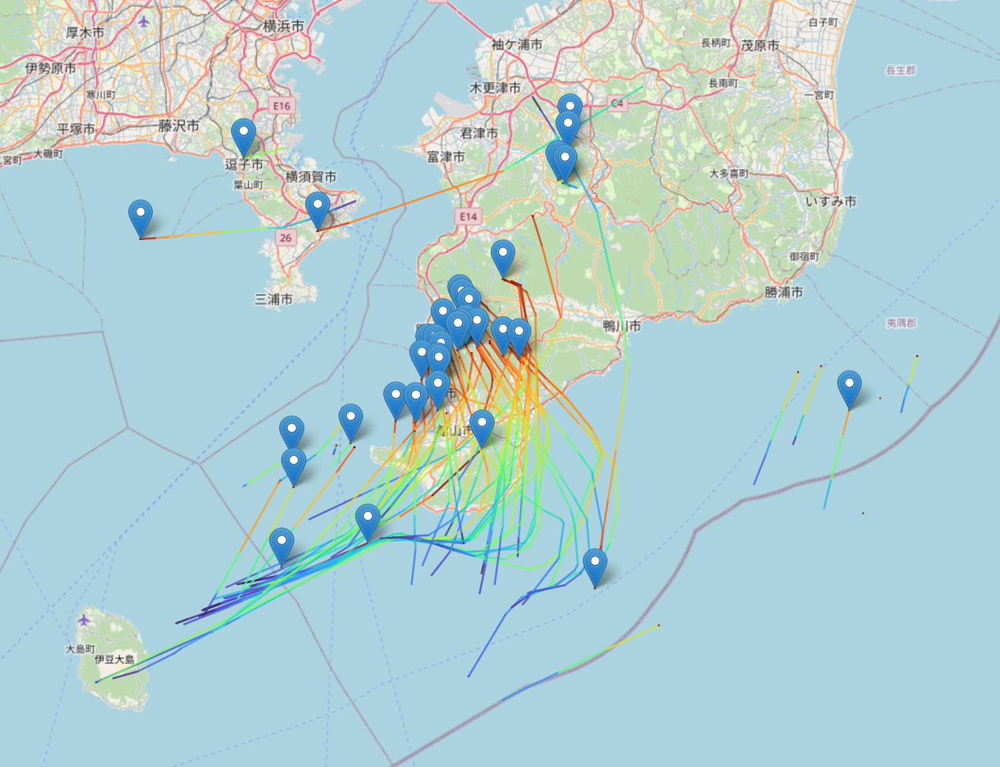

# ADS-B + AMeDAS Lab

This repository collects ADS-B data and AMeDAS 10-minute weather data into PostgreSQL for lab / experimentation use.

- 日本語の説明: [README_ja.md](README_ja.md)
- English description: [README_en.md](README_en.md)

